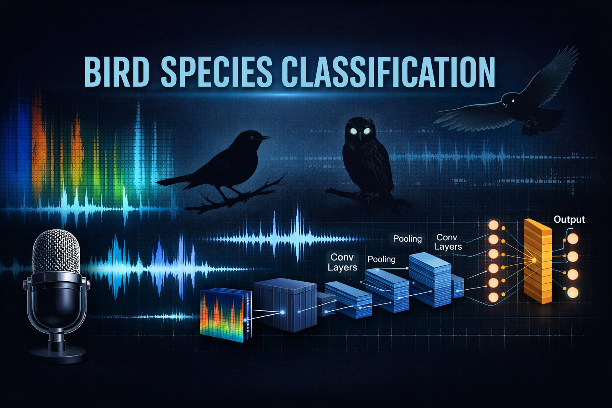
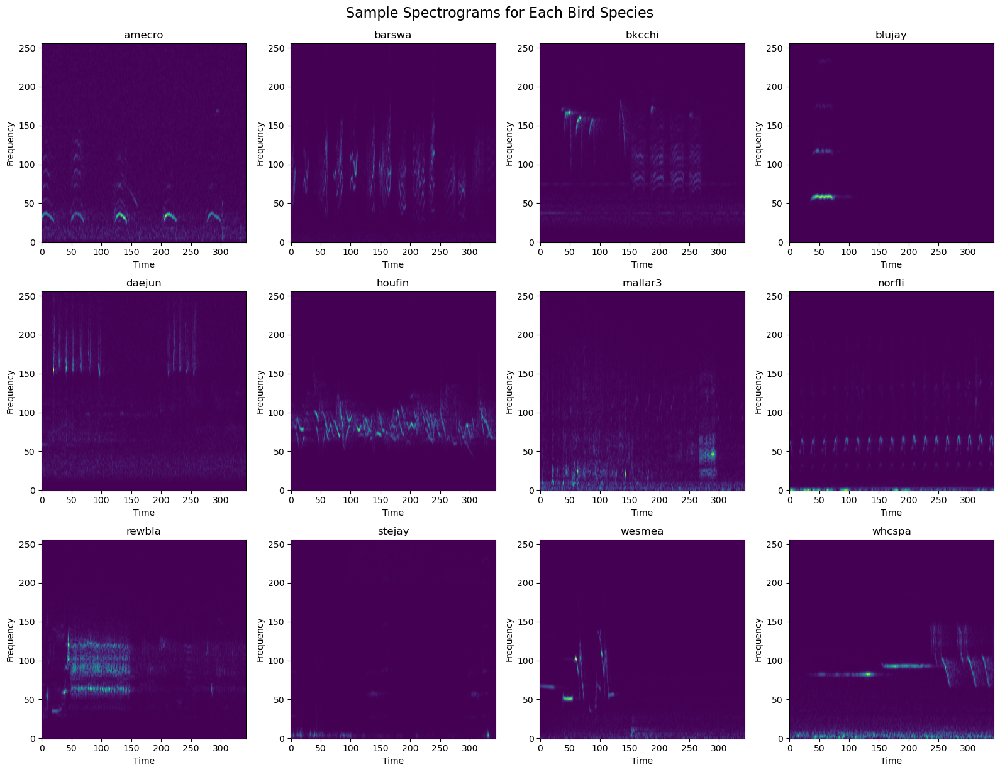
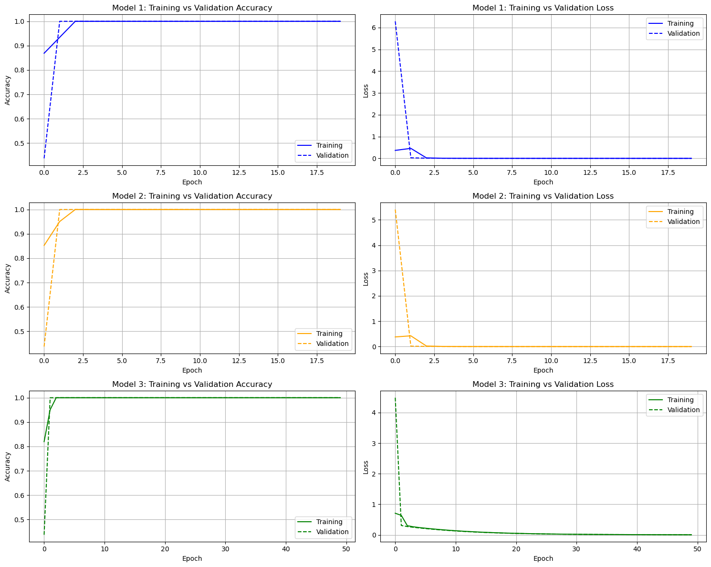
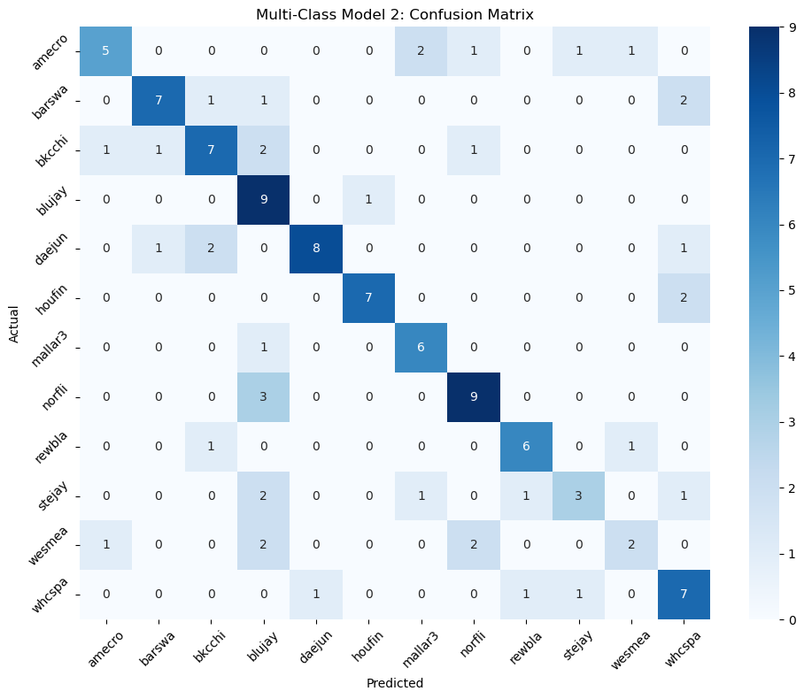
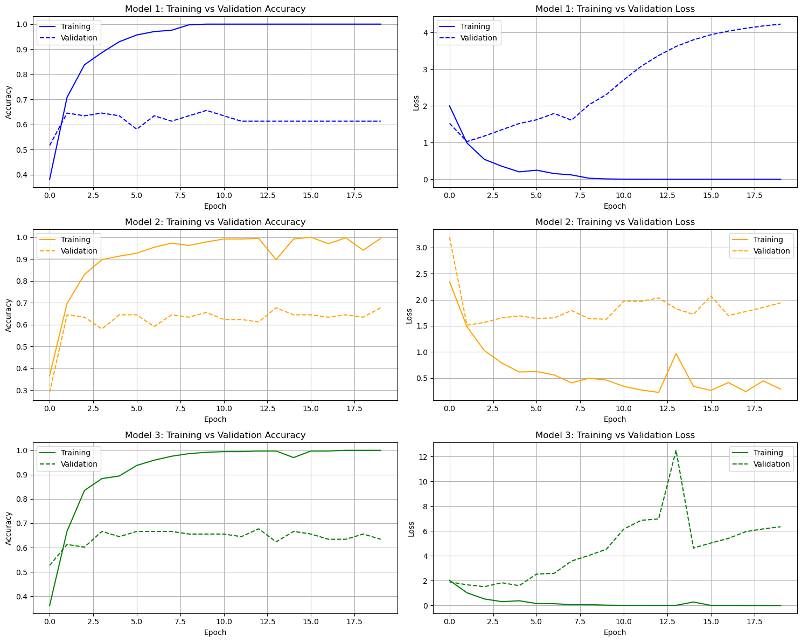

# Bird Species Classification Using CNN on Audio Spectrograms




---

## Overview

This project implements convolutional neural networks (CNNs) to classify bird species based on acoustic features from their vocalizations. Using spectrogram representations of audio recordings from 12 bird species common to the Seattle area, the project compares multiple CNN architectures for both binary and multi-class classification tasks. The goal is to develop an automated bird identification system that can distinguish species from their calls and songs.

**Business Problem:** Can deep learning models accurately identify bird species from their vocalizations to support wildlife monitoring, biodiversity research, and automated species detection systems?

---

## Key Features

- **Binary classification** achieving 100% accuracy distinguishing between two bird species (American Crow vs House Finch)
- **Multi-class classification** across 12 Seattle-area bird species with 70% accuracy
- Custom CNN architectures with comparative analysis: Basic CNN, CNN with Dropout, CNN with L2 Regularization
- Spectrogram-based audio feature extraction converting 2-second audio clips into 343×256 images
- Comprehensive model evaluation including confusion matrices, accuracy/loss curves, and per-species performance analysis
- Overfitting detection and regularization strategy comparison

---

## Dataset

| Property | Detail |
|----------|--------|
| Source | [Xeno-Canto Bird Recordings Extended (A-M)](https://www.kaggle.com/datasets/rohanrao/xeno-canto-bird-recordings-extended-a-m) |
| Species | 12 bird species common to Seattle region |
| Audio Format | Spectrograms derived from MP3 audio clips |
| Spectrogram Size | 343 × 256 pixels (2-second windows) |
| Samples per Species | 36-59 samples (relatively balanced) |
| Total Samples | ~570 spectrograms across all species |
| Data Storage | HDF5 format for efficient processing |

### Species List
American Crow (amecro), House Finch (houfin), Blue Jay (blujay), Northern Flicker (norfli), Red-Winged Blackbird (rewbla), Mallard Duck (mallar3), Western Meadowlark (wesmea), and 5 additional Seattle-area species.

---

## Tech Stack

- **Python 3.9+**
- **TensorFlow / Keras** — deep learning framework for CNN implementation
- **NumPy** — numerical computations and array operations
- **h5py** — HDF5 file handling for audio data
- **Matplotlib / Seaborn** — visualizations and model performance plots
- **Scikit-learn** — train-test split and evaluation metrics
- **Jupyter Notebook** — analysis environment

---

## Installation

```bash
# Clone the repository
git clone https://github.com/yourusername/bird-sound-classification.git
cd bird-sound-classification

# Create and activate virtual environment
python -m venv venv
source venv/bin/activate  # On Windows: venv\Scripts\activate

# Install dependencies
pip install -r requirements.txt
```

---

## Project Structure

```
bird-sound-classification/
├── README.md
├── requirements.txt
├── dataset/
│   └── README.md (download instructions)
├── notebook/
│   └── bird_sound_classification.ipynb
└── images/
    ├── banner.png
    ├── spectrogram_samples.png
    ├── binary_performance.png
    ├── multiclass_confusion_matrix.png
    └── model_comparison.png
```

---

## How to Run

```bash
# Launch Jupyter Notebook
jupyter notebook notebook/bird_sound_classification.ipynb
```

Run all cells sequentially. The notebook is structured as: data loading → exploration → binary classification → multi-class classification → model comparison → evaluation.

---

## Results

### Binary Classification (American Crow vs House Finch)

| Model | Test Accuracy | Test Loss | Training Time |
|-------|---------------|-----------|---------------|
| Basic CNN | 100% | 0.000024 | Fastest |
| CNN + Dropout | 100% | 0.000025 | Medium |
| CNN + L2 Regularization | 100% | 0.000026 | Shortest (early stopping) |

**Winner:** Basic CNN — achieved perfect accuracy with simplest architecture and fastest convergence

### Multi-Class Classification (12 Species)

| Model | Test Accuracy | Test Loss | Overfitting |
|-------|---------------|-----------|-------------|
| Basic Multi-Class CNN | 65.5% | 2.15 | Severe |
| Regularized CNN (Dropout + L2) | **69.8%** | **1.73** | Moderate |

**Winner:** Regularized CNN — best generalization with lowest test loss despite moderate overfitting

### Key Insights

- **Perfect binary classification** demonstrates that some species pairs (American Crow vs House Finch) have completely distinct acoustic signatures
- **70% multi-class accuracy** indicates significant acoustic overlap between the 12 species — a realistic result given biological similarity
- **All models showed overfitting** on multi-class tasks (90%+ training accuracy vs 70% test accuracy), indicating limited dataset size and acoustic complexity
- **Regularization improved performance** — dropout and L2 regularization reduced overfitting and improved test accuracy by 4.3 percentage points

### Visualizations

**1. Sample Spectrograms Across 12 Species**
Each bird species has a unique acoustic signature visible in the spectrogram frequency patterns and temporal structures.



**2. Binary Classification Performance - All Models**
All three binary models converged to 100% accuracy within 3 epochs, with training and validation curves perfectly aligned.



**3. Multi-Class Confusion Matrix - Best Model**
The confusion matrix reveals which species are most frequently confused, highlighting acoustic similarity challenges.



**4. Multi-Class Model Comparison**
Model 2 (regularized) shows better validation loss control compared to the basic model, demonstrating the value of dropout and L2 regularization.



### Per-Species Performance Analysis

**Easiest to Classify:**
- American Crow (amecro): 82% accuracy
- House Finch (houfin): 80% accuracy
- Northern Flicker (norfli): 75% accuracy

**Most Challenging:**
- Red-Winged Blackbird (rewbla): 40% accuracy — frequently confused with multiple species
- Mallard Duck (mallar3): 50% accuracy — acoustic overlap with similar waterfowl vocalizations

### Business Interpretation

The results demonstrate that deep learning-based bird identification is highly effective for species with distinct vocalizations but faces challenges when acoustic features overlap. The 70% multi-class accuracy represents a practical baseline for automated wildlife monitoring systems, though additional data and architectural improvements could push performance higher.

The perfect binary classification suggests that species-specific detectors (binary classifiers) may outperform general multi-class models in real-world deployment scenarios where target species are pre-identified.

---

## Technical Highlights

### Model Architectures

**Binary CNN (Model 1 - Winner):**
```
- Conv2D (32 filters, 3x3) → ReLU → MaxPool2D
- Conv2D (64 filters, 3x3) → ReLU → MaxPool2D  
- Flatten → Dense (128) → ReLU → Dense (1) → Sigmoid
- Optimizer: Adam, Loss: Binary Crossentropy
```

**Multi-Class Regularized CNN (Model 2 - Winner):**
```
- Conv2D (32 filters, 3x3, L2=0.001) → ReLU → MaxPool2D
- Dropout (0.3)
- Conv2D (64 filters, 3x3, L2=0.001) → ReLU → MaxPool2D
- Dropout (0.3)  
- Flatten → Dense (128, L2=0.001) → ReLU → Dropout (0.5)
- Dense (12) → Softmax
- Optimizer: Adam, Loss: Categorical Crossentropy
```

### Training Strategy

- **Early stopping** with patience=5 to prevent overfitting
- **Train-test split:** 80/20 stratified by species
- **Normalization:** Pixel values scaled to [0, 1] range
- **Epochs:** 20 (binary), 20 (multi-class)
- **Batch size:** 32

---

## Challenges and Limitations

### Dataset Limitations
- **Small sample size** (36-59 samples per species) limits model generalization
- **Imbalanced data** with some species having 60% more samples than others
- **Limited acoustic variety** — spectrograms may not capture full vocal repertoire

### Model Challenges
- **Overfitting** in multi-class models despite regularization (90% train vs 70% test)
- **Species confusion** between acoustically similar birds (e.g., rewbla, mallar3)
- **Single-species focus** — models assume one species per audio clip, no multi-species detection

### Real-World Deployment Considerations
- Background noise and environmental audio not represented in clean dataset
- Model performance may degrade with real-world field recordings
- Requires controlled 2-second audio windows for prediction

---

## Future Work

- **Data augmentation** with time-stretching, pitch-shifting, and noise injection to increase sample diversity
- **Transfer learning** using pre-trained audio models (VGGish, YAMNet) to improve feature extraction
- **Attention mechanisms** to focus on specific frequency bands and temporal patterns in spectrograms
- **Ensemble methods** combining multiple models for improved multi-class accuracy
- **Real-world validation** with field recordings containing background noise and multiple species
- **Expand to more species** with larger, more balanced datasets
- **Multi-label classification** to detect multiple bird species in a single audio clip

---

## Practical Applications

- **Wildlife monitoring** — automated species detection in ecological surveys
- **Biodiversity research** — large-scale acoustic monitoring of bird populations
- **Citizen science** — mobile apps for bird identification from recordings
- **Conservation** — tracking endangered species through passive acoustic monitoring
- **Education** — interactive tools for learning bird vocalizations